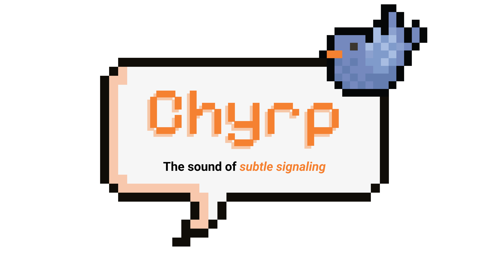

<div style="text-align: center">

</div>

# chyrp

**Toasts that get your attention.**

Chyrp (Pronounced "Chirp") is a tiny, dependency-free toast notification library. Ships with stacking, swipe-to-dismiss, pause-on-hover, sound, promise integration, and much more — all in around 30 kB of unminified, sourcemapped JS.

- Zero runtime dependencies
- ESM, CJS, and IIFE bundles (~6kB gzipped/ea.\*)
- Full TypeScript types
- Mobile-aware (auto-positions to `bottom-center`, larger hit targets)
- Respects `prefers-reduced-motion`
- Dark mode support via `prefers-color-scheme` and manual override

<sup>\* Not including CSS or optional source maps. CSS is mandatory and adds an additional 3 kB (gzipped) to overall size</sup>

<details>

<summary>Why <em><strong>another</strong></em> library?</summary>

Let's get something out of the way: you don't *have* to use it. I **promise** that other toast libraries exist which will meet your needs. [Sonner](https://github.com/emilkowalski/sonner), [Toast-JS](https://github.com/SoufianoDev/Toast-JS), [Toastify-JS](https://github.com/apvarun/toastify-js), [not-a-toast](https://github.com/shaiksharzil/not-a-toast), [Notyf](https://github.com/caroso1222/notyf), and the list goes on and on. So, why make another? Well, for a few reasons.

1. **Necessity** — I'm working on an application which, without getting into technical details, has restrictions which limit our ability to use pretty much any existing library made in the past few years. The project doesn't use React, so Sonner is a non-starter. Other libraries exclude modern browsers, so that also limits our use. While this version of Chyrp targets ES2022, the internal nameless build I wrote targets ES5, is pure JS, and lacks many of the features Chyrp offers.
2. **Lightweight** — I wanted Chyrp to be feature-packed while still maintaining a tiny footprint. While it's not the smallest library from the list above, it does manage to stay relatively tiny. Chyrp is as "large" as it is because it considers styling secondary and puts features and usability first. Chyrp doesn't offer "themes" or animations like other libraries do. Instead, Chyrp aims to be the best at what it does. This isn't to say other libraries are "worse", they just might not be the right tool for the job.

| Library     | CSS Size<sup>[1]</sup>                  | JS Size<sup>[1]</sup>  | Total Size  |
|-------------|-----------------------------------------|------------------------|-------------|
| Toastify-JS | 1.91kB                                  | 3.45kB                 | 5.36kB      |
| Notyf       | 2.41kB                                  | 3.58kB                 | 5.99kB      |
| **Chyrp**   | **3.32kB (not yet minified in builds)** | **6.79kB**             | **10.11kB** |
| not-a-toast | 4.68kB                                  | 6.30kB                 | 10.98kB     |
| Toast-JS    | ??                                      | ~50kB<sup>[2]</sup>    | ~50kB       |

3. **Feature Packed** — Like I mentioned previously, I wanted Chyrp to have all the features you'd need from a toast library. Chyrp has 16 configurable options, and supports additional features to allow each toast to behave as it should. Some of my favorite features which are not commonly seen in other libraries include:
    * **Sound** — Notifications are meant to get your attention. If you are sending toast messages to users, it's implied you _want_ them to know what's going on, no? Toast notifications are meant for brief messages to be immediately delivered to a user, sound assists with that. Chyrp is the first toast library I've seen that provides audio for toasts, **and** it's the first I've seen to use the Web Audio API to synthesize that audio on the fly. When I designed Chyrp, I made the (arguably radical) decision to enable audio by default. However, it can be disabled entirely.
    * **Debouncing** — Duplicate toasts sent within a specified amount of time will be debounced and only display the original. Configurable **per toast**.
    * **In-Place Updates** — Each toast returns a `ToastHandle` when created, which allows you to update *that specific toast* when needed. You are able to change the style, title, body, and virtually any value on that toast _without_ being required to create a new one or "replace" it within the DOM.
    * **`alert()` Replacement** — Chyrp allows you to replace the native `window.alert()` method, so even if you have a legacy codebase with `alert()` used for notifications, Chyrp will display a nice `info` style toast instead. Soon, `confirm()` will also be replaceable, automatically handling applying actions to `info` style toasts. Plus, using a toast as opposed to `alert()` or `confirm()` will prevent browsers ignoring in-page dialogs from hiding your messages, which might be important! Of course, this is opt-in and you can restore `window.alert()` if you like later to its native functionality.
5. **Accessibility** — While many of the larger Toast libraries have implemented ARIA tags, some have not. Another feature that many toast libraries seem to omit is support for Reduced Motion, which should be used to limit animations & effects. Chyrp ensures that Toasts are fully accessible and adhere to `prefers-reduced-motion: reduce;`, and I'm working on improving its accessibility even more.
6. **Mobile Support** — Many libraries support mobile, but that support is limited. Some libraries don't handle touch properly, while others don't format toasts to be mobile-friendly. Chyrp ensures that mobile is handled natively, properly capturing pointer events and provide larger touch targets for toasts. Since toasts can be dismissed by clicking/tapping anywhere within them, as opposed to being required to click an x or close icon, this makes them very user & mobile friendly!
7. **More Options** — Having options is never necessarily a bad thing. I've written my own toast libraries (besides this one) in the past because for projects because existing options didn't give me what I was looking for, or were too hard - or impossible - to extend to add, remove, or fix what I wanted added, removed, or fixed. Chyrp adds yet another option to the mix, which allows for developers to have more options if they don't like or can't use existing libraries.

<sup>[1] "Size" references to the _transferred_ size, not _decompressed_ size. Obtained on May 8th, 2026. Data obtained by opening each library's provided CDN link in a new tab in Firefox 151.0b7 with cache disabled and reviewing the "Transferred" value within the network inspector.</sup><br />
<sup>[2] Toast-JS provides its CSS within its JS. As well, it's unminified, which **will** affect transfer size.</sup>

</details>

## Install

```bash
npm install chyrp
```

## Quick start

```ts
import { chyrp } from 'chyrp';
import 'chyrp/style.css';

chyrp({ body: 'Hello world' });

chyrp.info('Saved');
chyrp.warning('Disk almost full');
chyrp.error('Upload failed');
chyrp.loading('Uploading…');
```

The CSS import is required — it's a side-effect import that injects the toast container styles. If you bundle CSS separately (e.g. CSS modules + a stylesheet pipeline), import it once at your app entry.

## API

### `chyrp(opts)` and convenience methods

```ts
chyrp({ title: 'Saved', body: 'Your changes are live', style: 'info' });

chyrp.info('Saved', { title: 'Success' });
chyrp.warning('Disk almost full');
chyrp.error('Upload failed', { persistent: true });
chyrp.loading('Uploading…', { max: 100, value: 0 });
```

All forms return a `ToastHandle`:

```ts
interface ToastHandle {
  dismiss(): void;
  update(opts: ToastOptions): ToastHandle;
}
```

### Promise integration

```ts
chyrp.promise(api.saveUser(user), {
  loading: 'Saving…',
  success: (user) => `Saved ${user.name}`,
  error:   (err)  => ({ title: 'Save failed', body: err.message }),
});
```

Each branch may be a string (used as `body`), an options object, or a function returning either.

### Determinate progress

```ts
const handle = chyrp.loading('Uploading', { max: 100, value: 0 });

uploader.on('progress', (n) => handle.update({ value: n }));
uploader.on('done',     ()  => handle.update({ style: 'info', body: 'Done', timeout: 2000 }));
```

When `max > 0`, the icon is a donut filled in proportion to `value / max`. Otherwise it's an indeterminate spinner.

### Channels

Group related toasts under a name and dismiss them together. The channel also renders as a small italic label in the corner of the toast.

```ts
import { chyrp, dismissChannel } from 'chyrp';

chyrp.info('Connection lost', { channel: 'network', persistent: true });
chyrp.info('Retrying…',        { channel: 'network' });

// later, when the network comes back:
dismissChannel('network');
```

### Action buttons

```ts
chyrp({
  title: 'File deleted',
  body: 'document.pdf was moved to trash',
  actions: [
    { label: 'Undo', style: 'primary', onClick: () => restore() },
    { label: 'Dismiss' },
  ],
});
```

`onClick` returning `false` keeps the toast open; otherwise it auto-dismisses.

### Configuration

```ts
import { configure } from 'chyrp';

configure({
  position: 'bottom-right',
  pauseOnHover: true,
  sound: false,           // true | 'gentle' | 'alert' | 'success' | 'error' | <url>
  resound: true,          // replay sound when handle.update({ style }) changes style
});
```

Per-call options always win over global defaults.

### Sound

```ts
chyrp.error('Save failed', { sound: true });        // style-aware default
chyrp.info('Saved',        { sound: 'success' });   // named chime
chyrp.info('Custom',       { sound: '/ding.mp3' }); // custom URL
```

Named chimes are synthesized with the Web Audio API, so they have no asset dependency.

Enable style-change replay per toast:

```ts
const h = chyrp.loading('Uploading', { sound: true, resound: true });
h.update({ style: 'info', body: 'Upload complete' }); // plays style-mapped success chime
```

Or set it globally:

```ts
configure({ resound: true });
```

### Dismiss helpers

```ts
import { dismissAll, dismissChannel } from 'chyrp';

dismissAll();              // dismiss every live toast
dismissChannel('network'); // dismiss everything tagged 'network'
```

### Optional `alert()` override

This is opt-in because libraries shouldn't monkey-patch globals on import:

```ts
import { interceptAlert } from 'chyrp';

const restore = interceptAlert();
window.alert('hello'); // shows as an info toast

restore(); // put the native alert back
```

## CDN / `<script>` usage

```html
<link rel="stylesheet" href="https://unpkg.com/chyrp/dist/style.css" />
<script src="https://unpkg.com/chyrp/dist/index.iife.js"></script>
<script>
  Chyrp.chyrp.info('Hello');
</script>
```

## Options reference

| Option         | Type                                                                                              | Default       | Notes                                                      |
| -------------- | ------------------------------------------------------------------------------------------------- | ------------- | ---------------------------------------------------------- |
| `title`        | `string`                                                                                          | `''`          | Bold heading above the body                                |
| `body`         | `string`                                                                                          | `''`          | Main message                                               |
| `style`        | `'info' \| 'warning' \| 'error' \| 'loading'`                                                     | `'info'`      | Visual style and default icon                              |
| `timeout`      | `number`                                                                                          | `4000`        | Ms before auto-dismiss; `0` disables                       |
| `persistent`   | `boolean`                                                                                         | `false`       | Equivalent to `timeout: 0`                                 |
| `debounce`     | `number`                                                                                          | `100`         | Ms to suppress identical follow-up toasts                  |
| `swipe`        | `boolean`                                                                                         | `true`        | Allow swipe-to-dismiss                                     |
| `pauseOnHover` | `boolean`                                                                                         | `true`        | Pause timer on pointer hover (desktop only)                |
| `position`     | `'top-right' \| 'top-left' \| 'top-center' \| 'bottom-right' \| 'bottom-left' \| 'bottom-center'` | `'top-right'` | Mobile always forces `bottom-center`                       |
| `channel`      | `string`                                                                                          | —             | Tag for grouping; rendered as a label                      |
| `icon`         | `string \| HTMLElement \| false`                                                                  | —             | Custom icon (text, cloned DOM node, or hide)               |
| `actions`      | `ToastAction[]`                                                                                   | —             | Buttons rendered below the body                            |
| `sound`        | `boolean \| 'gentle' \| 'alert' \| 'success' \| 'error' \| string`                                | `true`        | Named chime, URL, or `true` for style default              |
| `resound`      | `boolean`                                                                                         | `false`       | Replay sound when `handle.update({ style })` changes style |
| `max`          | `number`                                                                                          | —             | (loading) total work units for determinate donut           |
| `value`        | `number`                                                                                          | `0`           | (loading) current progress                                 |

## Accessibility

- Toasts are `role="button"` with `tabindex="0"`. Enter / Space dismiss.
- Keyboard focus pauses the auto-dismiss timer (same as hover).
- The overflow pill is keyboard-activatable.
- All animation durations collapse to fades when `prefers-reduced-motion: reduce` is set.

## Dark mode

Toasts automatically adapt to dark backgrounds when the user's OS reports `prefers-color-scheme: dark`. All colors are defined as CSS custom properties prefixed with `--tt-`, so you can override any of them.

To force a specific theme regardless of system preference, add a class to the `<html>` element:

```html
<!-- Force dark mode -->
<html class="dark">

<!-- Force light mode -->
<html class="light">

<!-- Follow system preference (default) -->
<html>
```

You can also override individual variables to customize the toast appearance:

```css
:root {
  --tt-bg: #1a1a2e;
  --tt-title-color: #eee;
  --tt-body-color: #ccc;
  --tt-info: #00d2ff;
}
```

## Browser support

Targets ES2022. Pointer events are required for swipe-to-dismiss; if `PointerEvent` is unavailable, swipe is disabled and click-to-dismiss still works.

## Demo

A full interactive demo + docs site lives under `demo/`. After cloning:

```bash
npm install
npm run demo # builds the app, served at http://localhost:5173/
```

When the demo is running, the library and docs site is rebuilt/refreshed upon modification. The docs are also exposed to your LAN for testing on mobile. Every feature in this README has a runnable example there.

## License

MIT
